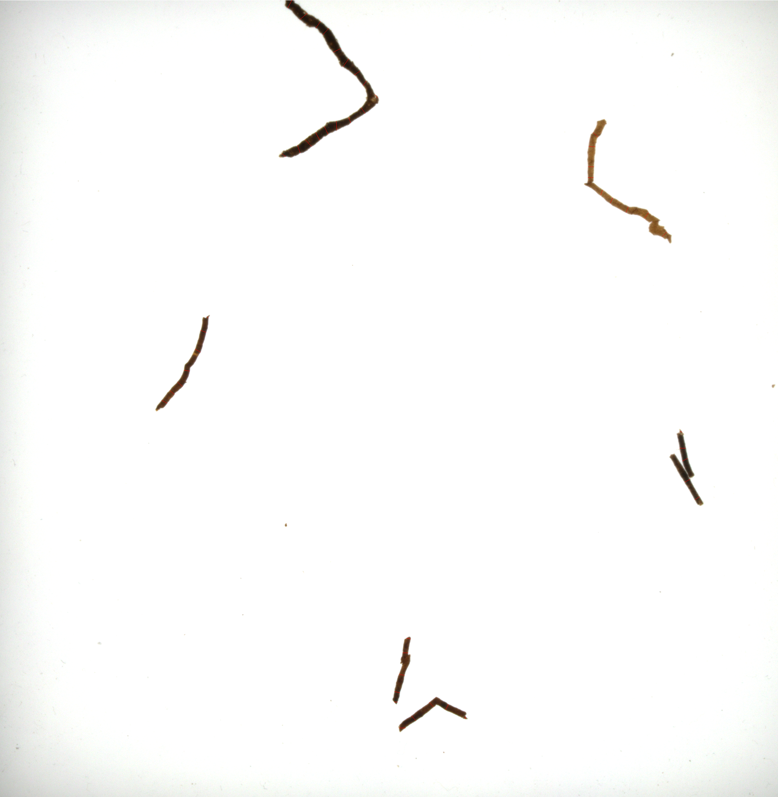

# 烟丝检测报告

**步骤：边缘裁剪->补白边->灰度化->二值化->寻找连通域->连通域划线->模型筛选->对筛选后计算距离**

## 前期拍摄

**拍摄亮度：**

5（+5）或者 5（+6）

图片要尽可能的正，上下玻璃板在图片边缘，左右有黑色边距，如图1所示

​													图1：烟丝拍摄样张

## 图片预处理

边缘裁剪补白边参数：

在补边的过程中遵循裁剪多少补多少的原则，参数如下：

*参数说明：`detector.cut_hor`表示1号区域；`detector.cut_vet`表示2号区域；`detector.cut_bot`表示3号区域；（如图1所示）*

- 5（+5）：`detector.cut_hor=800；detector.cut_vet=270；detector.cut_bot=330`
- 5（+6）：`detector.cut_hor=740；detector.cut_vet=240；detector.cut_bot=280`

拍摄灯光改变后，需要改变参数，位置在config.py文件中（如果非必要，尽量不改变拍摄亮度）

二值化：

采用opencv库中`cv2.threshold`函数，阈值参数为**150**，意义为灰度图像中像素点灰度值>150，置为255(白色)，<150置为0(黑色)

​													图2：二值化图像

连通域：

连通域采用opencv库中`cv2.findContours`函数，对于连通域长度<30予以丢弃。参数为`cont_len_thres`。

​															图3：连通域图

## 寻找划线

寻找划线一共有三种方法：`skeleton`，`parallel`，`hybrid`，参数为`detector.method`，如若修改划线方法，修改config.py文件中`detector.method`等于选用方法

以图2所示图像进行划线，当前选用的方法为`hybrid`

​																图4：画线图

## 模型筛选

**网络模型**：`resnet50`

**数据增强**：`T.CenterCrop((64, 64))`；`T.RandomHorizontalFlip(0.5)`；`T.RandomVerticalFlip(0.5)`；

`T.Normalize(mean=[0.485, 0.456, 0.406],std=[0.229, 0.224, 0.225])`  

 `k折交叉验证` https://blog.csdn.net/foneone/article/details/104445320

`WeightedRandomSampler` https://www.cxyzjd.com/article/weixin_40970506/109467365

**优化函数及学习率**：  `optimizer = optim.Adam(model.backbone.parameters(), lr=3.5e-04, weight_decay=5e-4, betas=(0.9, 0.999))`

  `scheduler = torch.optim.lr_scheduler.MultiStepLR(optimizer, milestones=[20, 40], gamma=0.1)`

**超参数：**训练集batch=16    测试集batch=8

（9/24)

**数据量：**总样本数量：46869   正样本数量：14690  负样本数量：32179

**训练集及验证集准确率**：训练集95%  验证集90%

**冲突样本：**正样本冲突：512，负样本冲突：2197

​													图5：准确率曲线图

## 准确率统计

### **5(+5) 亮度测试**

.bmp)

​											图6: 5（+5）亮度检测样张

**样本1**

*实正、实负表示预测结果中实际为正样本或者负样本*

|              | 预正（个数）26 | 预负（个数）18 |
| ------------ | -------------- | -------------- |
| 实正（个数） | 26/26=**100%** | 10/18=55%      |
| 实负（个数） | 0              | 8/18=44%       |

**样本2**

|              | 预正（个数）37 | 预负（个数）14 |
| ------------ | -------------- | -------------- |
| 实正（个数） | 36/37=**97%**  | 6/14=42%       |
| 实负（个数） | 1/37=3%        | 8/14=58%       |

**样本3**

|              | 预正（个数）24 | 预负（个数）11 |
| ------------ | -------------- | -------------- |
| 实正（个数） | 24/24=**100%** | 3/11=27%       |
| 实负（个数） | 0              | 8/11=73%       |

**样本4**

|              | 预正（个数）57 | 预负（个数）13 |
| ------------ | -------------- | -------------- |
| 实正（个数） | 56/57=**98%**  | 3/13=23%       |
| 实负（个数） | 1/57=2%        | 10/13=77%      |

### 5（+6)亮度测试

.bmp)

​											图7: 5（+6）亮度检测样张

**样本1**

*实正、实负表示预测结果中实际为正样本或者负样本*

|              | 预正（个数）44 | 预负（个数）9 |
| ------------ | -------------- | ------------- |
| 实正（个数） | 43/44=**97%**  | 2/9=22%       |
| 实负（个数） | 1/44=3%        | 7/9=78%       |

**样本2**

|              | 预正（个数）26 | 预负（个数）24 |
| ------------ | -------------- | -------------- |
| 实正（个数） | 25/26=**96%**  | 9/24=37.5%     |
| 实负（个数） | 1/26=4%        | 15/24=62.5%    |

**样本3**

|              | 预正（个数）27 | 预负（个数）8 |
| ------------ | -------------- | ------------- |
| 实正（个数） | **100%**       | 2/8=25%       |
| 实负（个数） | 0              | 6/8=75%       |

**样本4**

|              | 预正（个数）57 | 预负（个数）12 |
| ------------ | -------------- | -------------- |
| 实正（个数） | 55/57=**96%**  | 1/12=8%        |
| 实负（个数） | 2/57=4%        | 11/12=92%      |

## 烟丝宽度测量结果

### 烟丝标准摆放

​    										图8：标准摆放烟丝检测样本示意图

**样本1**

| 过滤前（线/条数） | 过滤后（线/条数） | 过滤后负样本（线/条数） | 本地测试宽度（mm）                                           | 烟厂测试宽度（mm)                                            | 误差（均值、方差） |
| ----------------- | ----------------- | ----------------------- | ------------------------------------------------------------ | ------------------------------------------------------------ | ------------------ |
| 102               | 79                | 0                       | **1号**：0.93；**5号**：0.83；**8号**：0.89；**11号**：0.93； | **1号**：0.94；**5号**：0.88；**8号**：0.92；**11号**：0.92； | 0.025、0.0009      |

**样本2**

| 过滤前（线/条数） | 过滤后（线/条数） | 过滤后负样本（线/条数） | 本地测试宽度（mm）                                           | 烟厂测试宽度（mm)                                            | 误差（均值、方差） |
| ----------------- | ----------------- | ----------------------- | ------------------------------------------------------------ | ------------------------------------------------------------ | ------------------ |
| 100               | 62                | 0                       | **1号**：0.92；**5号**：0.80；**8号**：0.92；**11号**：0.95； | **1号**：0.94；**5号**：0.88；**8号**：0.92；**11号**：0.92； | 0.0325、0.001925   |

**样本3**

| 过滤前（线/条数） | 过滤后（线/条数） | 过滤后负样本（线/条数） | 本地测试宽度（mm）                                           | 烟厂测试宽度（mm)                                            | 误差（均值、方差） |
| ----------------- | ----------------- | ----------------------- | ------------------------------------------------------------ | ------------------------------------------------------------ | ------------------ |
| 102               | 74                | 0                       | **1号**：0.88；**5号**：0.80；**8号**：0.93；**11号**：0.94； | **1号**：0.94；**5号**：0.88；**8号**：0.92；**11号**：0.92； | 0.0425、0.002625   |

**样本4**

| 过滤前（线/条数） | 过滤后（线/条数） | 过滤后负样本（线/条数） | 本地测试宽度（mm）                                           | 烟厂测试宽度（mm)                                            | 误差（均值、方差） |
| ----------------- | ----------------- | ----------------------- | ------------------------------------------------------------ | ------------------------------------------------------------ | ------------------ |
| 102               | 73                | 0                       | **1号**：0.91；**5号**：0.80；**8号**：0.91；**11号**：0.92； | **1号**：0.94；**5号**：0.88；**8号**：0.92；**11号**：0.92； | 0.06、0.00185      |

**样本5**

| 过滤前（线/条数） | 过滤后（线/条数） | 过滤后负样本（线/条数） | 本地测试宽度（mm）                                           | 烟厂测试宽度（mm)                                            | 误差（均值、方差） |
| ----------------- | ----------------- | ----------------------- | ------------------------------------------------------------ | ------------------------------------------------------------ | ------------------ |
| 111               | 81                | 0                       | **1号**：0.90；**5号**：0.81；**8号**：0.93；**11号**：0.93； | **1号**：0.94；**5号**：0.88；**8号**：0.92；**11号**：0.92； | 0.0325、0.001675   |

### 烟丝堆叠随机摆放（机械臂抓取）

## 参数列表

*以下所述参数皆在config.py文件中，如若变更，直接修改即可*

| 参数名称       | 含义                 | 值                         |
| -------------- | -------------------- | -------------------------- |
| method         | 划线检测方法         | skeleton、parallel、hybrid |
| cut_hor        | 左右裁边             | 5（+5）800     5（+6）770  |
| cut_vet        | 上裁边               | 5（+5）270     5（+6）240  |
| cut_bot        | 下裁边               | 5（+5）330     5（+6）280  |
| cont_len_thres | 连通域长度筛选比较值 | 30                         |
|                |                      |                            |

